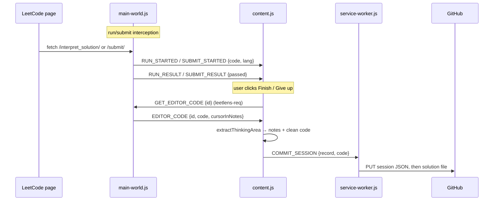

# Architecture

One page on how LeetLens is put together and why. Setup lives in the [README](README.md); contributor workflow in [CONTRIBUTING.md](CONTRIBUTING.md).

## The two-repo model

This repo is **the tool only**. Every user's data — session JSON, solution files, the generated index — lives in a repo *they* own (new, or an existing LeetHub repo; the layouts are compatible).

The extension's **Set up repo** button turns any repo into a data repo by committing (source of truth: `extension/src/lib/repo-setup.js`):

- `.github/workflows/publish.yml` — on each push, checks out this tool repo at `.leetlens/`, rebuilds `data/index.json` with the indexer, commits it, and deploys the dashboard + index to GitHub Pages.
- `data/sessions/.gitkeep` — the folder session records land in.
- `AGENTS.md` (+ `CLAUDE.md` importing it) and `.mcp.json` — so a coding agent that opens the repo as a folder knows the layout, and Claude Code offers the MCP server on open.

Data repos pin the toolchain with `LEETLENS_REF: v1`, a **moving major tag**:

- Compatible change (indexer, dashboard, MCP): move `v1` forward — every data repo picks it up on its next push, no action needed.
- Breaking change (session schema, index shape, dashboard data contract): cut `v2` and leave `v1` alone — users upgrade by editing one line when ready.

**Sharp edge:** the workflow file is *copied* into each data repo at setup time, so moving the tag ships fixes to the toolchain under `.leetlens/` but **not** to the workflow itself. A workflow bug means every existing data repo must re-run Set up repo. Keep the workflow thin; put logic where the tag can carry it.

## Build

Sources live in `extension/`; `npm run build` bundles them into `dist/`, which is what Chrome loads. `dist/` is gitignored — users get it as a zip attached to each release.

Four entry points, and the output format is not a preference:

| Entry | Output | Format |
|---|---|---|
| `src/inject/main-world.js` | `dist/main-world.js` | `iife` — classic script |
| `src/content/content.js` | `dist/content.js` | `iife` — classic script |
| `src/background/service-worker.js` | `dist/service-worker.js` | `esm` — manifest declares `"type": "module"` |
| `extension/options.js` | `dist/options.js` | `esm` — `options.html` uses `type="module"` |

Chrome loads content scripts as **classic scripts**, so an `import` surviving into either of the first two is a runtime error; CI parses both as CommonJS to catch it. A format mismatch on the latter two fails registration with no useful error, which is why they are pinned rather than left to default.

Bundling is also what lets `main-world.js` share code at all: it has no `chrome.*`, so the dynamic-`import(chrome.runtime.getURL(...))` trick other content scripts use is unavailable to it. That trick is what `web_accessible_resources` used to exist for; bundling removed both.

## Extension layout

The split below is not a style choice — **Chrome's extension worlds force it**. A MAIN-world script can touch the page's JavaScript (Monaco, `fetch`) but no `chrome.*` APIs; an isolated-world content script is the reverse; only the service worker outlives the tab. (Neither can use ES modules *at runtime* — the bundler resolves that at build time, so you can still `import` freely in the sources.)

| File | World | Role |
|---|---|---|
| `src/inject/main-world.js` | MAIN (page) | Eyes and hands inside LeetCode: intercepts run/submit network traffic, injects the thinking area into Monaco, answers editor-read requests |
| `src/content/content.js` | isolated | Controller: session lifecycle, bridges MAIN-world events, persistence, hands finished sessions to the service worker |
| `src/state/session-machine.js` | isolated | Model: phase state machine, pure data — no DOM, no `chrome.*`, snapshot/restorable |
| `src/content/panel.js` + `panel.css.js` | isolated | View: closed-shadow-DOM panel — live timer and the save form |
| `src/lib/leetcode-endpoints.js` | both | Every LeetCode URL, selector and API shape; the only file to touch when LeetCode changes |
| `src/lib/thinking-area.js`, `src/lib/languages.js`, `src/lib/messages.js` | both | The thinking-block format (write and parse sides), the language-slug tables, and the `postMessage` source tags — one definition each, inlined into both worlds by the bundler |
| `src/lib/github.js`, `src/lib/repo-setup.js` | worker | GitHub Contents API client; one-click data-repo setup |
| `src/lib/paths.js` | worker | Where session, solution and per-attempt files land — a contract the indexer and MCP server read back |
| `src/background/service-worker.js` | worker | Commits sessions + solutions; queues and retries failures across restarts |

## Message flows

Two `postMessage` source tags keep the channel loop-free: the MAIN world emits events tagged `leetlens`, and listens only for requests tagged `leetlens-req`.



The Finish-time read times out after 250 ms and falls back to the last run/submit capture, so finishing never hangs on a missing injector. The reply also reports whether the caret is inside the thinking block — typing there stays in the *thinking* phase instead of flipping the timer to *writing*.

## The thinking-area contract

The block injected at the top of the editor **must be a block comment** (`r"""…"""`, `/* … */`, `=begin/=end`, `#|…|#`): Monaco does not re-insert a line-comment token on Enter, so a `#`-prefixed region turns into live code on the second line of notes. Languages with no block-comment form (Erlang, Elixir, Bash) get no block.

Two invariants, both pinned by `test/thinking-area.test.mjs`:

- `THINK_HEADER_RE` (in `src/lib/thinking-area.js`, shared by the writer in `main-world.js` and the parser) must recognise every opener `thinkingBlock()` can write, or a cloud-save-restored block goes undetected and a duplicate is prepended on every reload.
- The pattern must **never** match `/**` — LeetCode's own `/** Definition for ListNode … */` template docblock would otherwise be stripped from committed solutions.

## Data flow

```
extension ──commit──▶ data repo ──workflow──▶ data/index.json ──▶ Pages dashboard
   (session JSON + solution)         │                  │
                                     │                  └──▶ hosted MCP server (mcp/app.py, one URL per repo)
                                     └──▶ local MCP server (clone, or .mcp.json in the data repo)
```

- `data/index.json` is **generated, never authored**, and it is the only generated file the copied workflow commits and deploys — so it also carries every full session record (`records`) for remote readers. When a concurrent run wins the push race, the workflow re-runs the indexer on top of what landed (`fetch` + `reset --hard`) — never `git pull --rebase`, which conflicts with itself on a generated file.
- The MCP server (`mcp/`, FastMCP) reads sessions through one `DataStore`: a local clone, or GitHub in one request via `index.json`. The hosted entrypoint mounts the same server under `/{owner}/{repo}/mcp` and resolves a store per request, so one deployment serves any public data repo.
- The extension pushes **two commits per save** (session, then solution), so data-repo CI must tolerate `main` moving mid-run. A solution is written twice within that second commit: `<dir_key>/<dir_key>.<ext>` always holds the newest attempt (LeetHub layout), and `<dir_key>/attempts/<stamp>_<id>.<ext>` preserves the one this session produced, which is what makes "what changed between the attempt that failed and the one that worked" answerable.
- `data/schema/session.schema.json` is the contract every component builds against, with `additionalProperties: false` throughout — new fields require a schema change, which is a **breaking** change per the tag policy above.
- Sessions carry **two** vocabularies: `tags` are the user's own and may be absent entirely, while `problem.topics` are LeetCode's and are recorded for every problem. Anything that ranks weaknesses takes a `kind` and defaults to whichever the user actually has, so the tool works for someone who never tags (`stats.by_label`, `rankingKind` in the dashboard).
